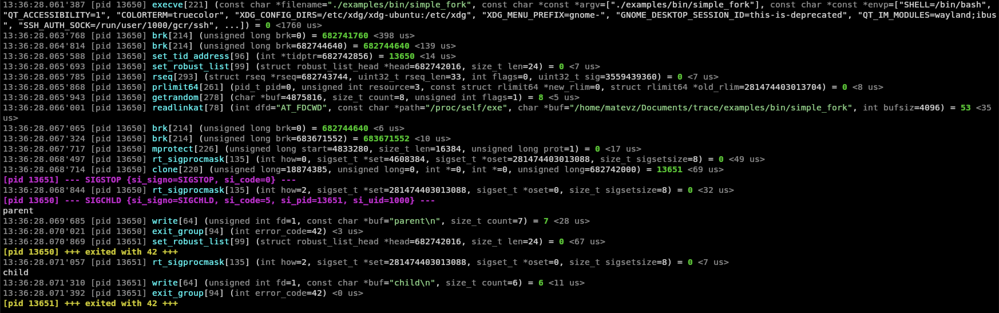
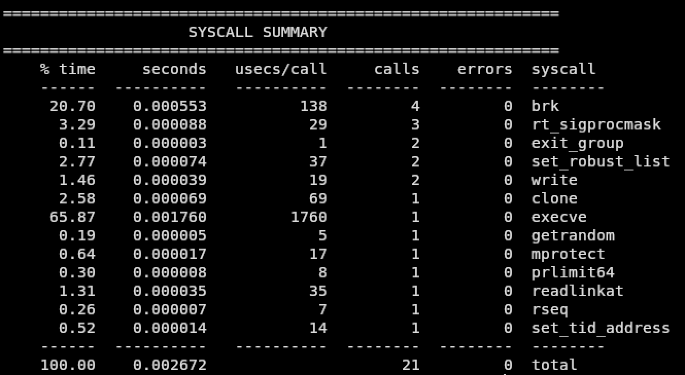

# trace

`trace` je majhen syscall tracer, napisan v C++20. Program zažene ciljni proces pod `ptrace`, prestreza njegove sistemske klice in izpisuje ime sistemskega klica, številko, argumente, povratno vrednost, napake, čas izvajanja, izhode procesov in signalne dogodke.

Projekt je trenutno narejen za Linux ARM64.

## Kaj zmore

- Sledi programu in njegovim argumentom.
- Izpisuje ime sistemskega klica, številko, PID, argumente in povratno vrednost.
- Sledi otrokom, ustvarjenim prek `fork`, `vfork` in `clone`.
- Zazna `exec`, normalen izhod procesa in končanje procesa s signalom.
- Filtrira sistemske klice po imenu ali številki.
- Prikaže čas vstopa v sistemski klic.
- Prikaže trajanje sistemskega klica v mikrosekundah ali nanosekundah.
- Po koncu izpiše syscall summary.
- Summary zna sortirati po času, sekundah, povprečnih mikrosekundah, številu klicev, napakah ali imenu sistemskega klica.
- Negativne povratne vrednosti pretvori v imena napak, na primer `ENOENT`.
- Obogati izbrane argumente pri klicih kot so`openat`, `close`, `read`, `write`, `execve`, `readlinkat`, `getcwd`, ...
- Podpira barvni izpis.

## Primer

### Navaden izpis

<!-- Dodaj sliko navadnega izpisa sem. Priporočena pot: docs/images/trace-output.png -->



### Syscall summary

<!-- Dodaj sliko syscall summary izpisa sem. Priporočena pot: docs/images/syscall-summary.png -->



## Zahteve

- Linux
- ARM64 syscall ABI
- CMake
- C++20 prevajalnik
- C prevajalnik za primere

Tracer uporablja Linux-specifične API-je, kot so `ptrace`, `/proc/<pid>/fd`, `waitpid` in ARM64 razpored registrov. Na macOS/Windows ne bo deloval brez portanja.

## Build

```sh
cmake -S . -B build
cmake --build build
```

Glavni binary:

```text
build/trace
```

Primeri se zgradijo v:

```text
examples/bin/
```

## Uporaba

```sh
./build/trace [opcije] -- program [argumenti...]
./build/trace [opcije] ./program [argumenti...]
```

Primeri:

```sh
./build/trace -- /bin/ls -la
./build/trace -tt -d ns -- /bin/echo hello
./build/trace --filter read,write,openat -- ./examples/bin/write_hello
./build/trace -s --sort=seconds/calls/syscall -- ./examples/bin/comprehensive_test
```

## Opcije

```text
-h, --help
    Izpiše pomoč in konča program.

-f, --filter LIST
    Izpiše samo izbrane sistemske klice.
    LIST je seznam imen ali številk, ločenih z vejico.
    Primer: --filter read,write,63,221

-t, --time
    Prikaže wall-clock čas vstopa v sistemski klic.

-tt, --ttime
    Prikaže wall-clock čas vstopa z mikrosekundno natančnostjo.

-d, --duration [UNIT]
    Prikaže trajanje sistemskega klica.
    UNIT je lahko us ali ns.
    Privzeto: us

--color-mode=MODE
    Nastavi barvni izpis.
    MODE je lahko auto, always ali never.
    Privzeto: auto

--buffer-len=LEN
    Omeji število prikazanih bajtov pri obogatenih nizih in bufferjih.
    Veljavno območje: 1-4096
    Privzeto: 64

--array-len=LEN
    Omeji število prikazanih elementov pri obogatenih poljih, kot sta argv in envp.
    Veljavno območje: 1-1024
    Privzeto: 8

-s, --summary
    Po koncu sledenja izpiše syscall summary.

--sort=COL1/COL2/...
    Nastavi vrstni red sortiranja v summary tabeli.
    Stolpci: time, seconds, usecs, calls, errors, syscall
    Privzeto: time/seconds/calls/errors/syscall
```

## Primer izpisa

```text
[pid 1234] write[64] (fd=1, buf="hello world\n", count=12) = 12
[pid 1234] openat[56] (dfd="AT_FDCWD", filename="/invalid/path", flags=0) = -2 ENOENT (No such file or directory)
[pid 1234] +++ exited with 42 +++
```

Z vklopljenim časom in trajanjem:

```text
12:34:56.123'456 [pid 1234] write[64] (fd=1, buf="hello\n", count=6) = 6 <1200 ns>
```

## Primeri v repozitoriju

- `examples/write_hello.c`: osnovni `write` in ne-ničelna izhodna koda.
- `examples/bad_open.c`: namerno neuspešen `open`.
- `examples/simple_fork.c`: sledenje staršu in otroku.
- `examples/comprehensive_test.c`: datoteke, pipe, mmap, signali, fork, exec in več otrok.

Zagon primera:

```sh
./build/trace -- ./examples/bin/simple_fork
```

## Struktura

```text
src/
    main.cpp             vstopna točka
    options.cpp          parsanje CLI opcij
    tracer.cpp           ptrace event loop
    syscall.cpp          formatiranje syscallov in obogatitev argumentov
    syscall_table.cpp    ARM64 syscall tabela
    utils.cpp            pomožne funkcije

include/trace/
    headerji projekta

examples/
    majhni C programi za testiranje tracerja

helpers/
    pomožne datoteke za generiranje syscall tabele
```

## Opomba

To je projekt za učenje in eksperimentiranje, ne popolna zamenjava za `strace`. Veliko argumentov sistemskih klicev se še vedno izpiše kot surova številska vrednost, obogatitev argumentov pa je namenoma omejena na izbrane sistemske klice.
